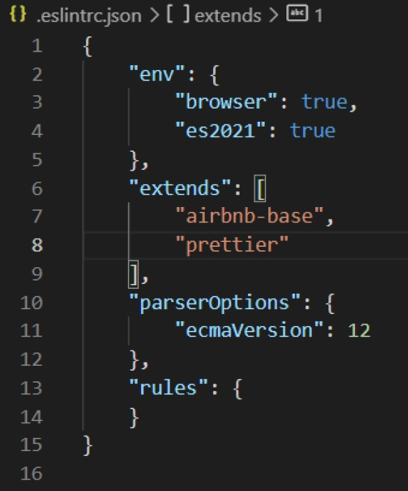
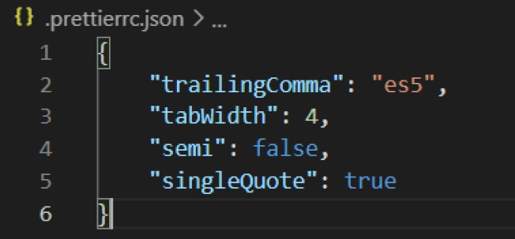

# ESLint/Prettier Local Install Guide

-   Run the following command in your terminal (I used git bash)
    -   `npm install --save-dev eslint-config-prettier`
        -   This installs eslint with prettier configuration so they work together
    -   run `npx eslint --init` and answer the questions as follows:
        -   How would you like to use ESLint?
            -   To check syntax, find problems, and enforce code style
        -   What type of modules does your project use?
            -   None of these
        -   Which framework does your project use?
            -   None of these
        -   Does your project use TypeScript?
            -   No
        -   Where does your code run?
            -   Node
        -   How would you like to define a style for your project?
            -   Use a popular style guide
        -   Which style guide do you want to follow?
            -   Airbnb
        -   What format do you want your config file to be in?
            -   JSON
        -   Would you like to install them now with npm?
            -   Yes
    -   run `npm install --save-dev --save-exact prettier`
    -   Double check to see that .eslintrc.json looks like this:
  
    - Double check to see that .prettierrc.json looks like this:
  

# Using ESLint
- To use ESLint, run the following command:
  - `npx eslint (file path)`
  - *Ex:* `npx eslint ./scripts/router.js`

# Using Prettier
- To use Prettier, run the following command:
  - `npx prettier --write (file path)`
  - *Ex:* `npx prettier --write ./scripts/router.js`
- To reformat an entire directory:
  - `npx prettier --write (folder/*)`
  - *Ex:* `npx prettier --write components/\*`
- To reformat the entire directory:
  - `npx prettier --write .` in the root directory of the project

# Important Note
If the `node_modules` directory is not already in the `.gitignore` file, then add it to `.gitignore`.

### Author: [Sergio Talavera](https://github.com/stalaver)